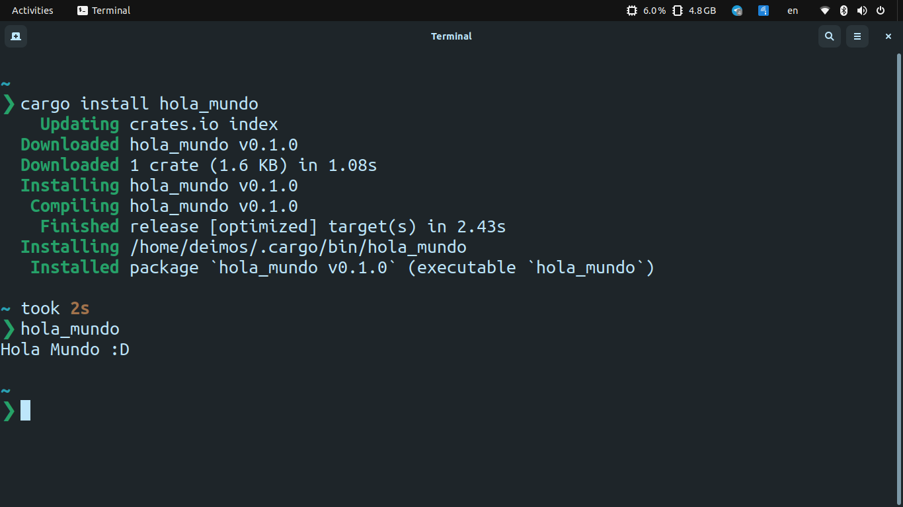

# What is hola_mundo?

hola_mundo is the classic hello world program but in Spanish. It's 
just a binary crate to test an upload to crates.io.

## Requirements

You need to have installed cargo on your system.

If you are using Windows, download the installer from the official page
in the following link:

~~~
https://www.rust-lang.org/tools/install
~~~

If you are using macOS,
GNU/Linux, WSL or a UNIX based system just type:

~~~
curl --proto '=https' --tlsv1.2 -sSf https://sh.rustup.rs | sh
~~~

## How to use it

In a terminal emulator type the following line:

~~~
cargo install hola_mundo
~~~

To run the program just type hola_mundo as shown in the next image.

	

